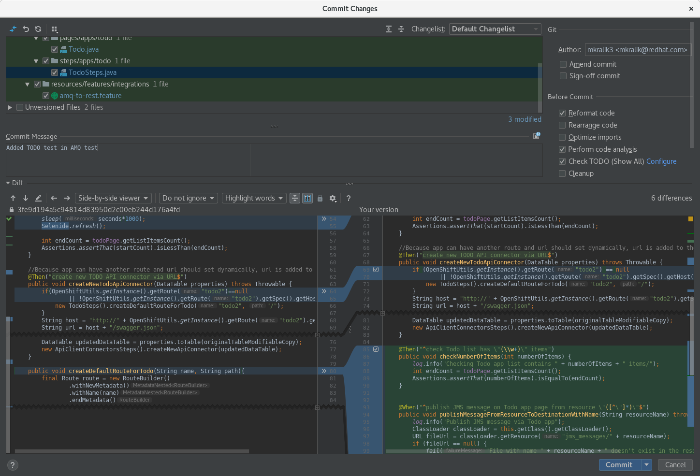

test# Syndesis QE

##### Table of Contents

* [Structure](#structure)
* [Prerequisites](#prerequisites)
* [Scenarios](#scenarios)
* [Configuration](#configuration)
* [Execution](#execution)
  * [Most common problems](#most-common-problems)
* [Contributing](#contributing)
  * [Checkstyle](#checkstyle)
  * [Creating a Pull Request](#creating-a-pull-request)
* [Advanced debugging](#advanced-debugging)
* [List of scenarios](#list-of-scenarios)

### Structure

```bash
├── docs
├── rest-tests
├── ui-tests
└── utilities
```

#### docs
On-going initiative to provide comprehensive guide to current code structure.
Contains a script `generateDocs.py` which produces list of all defined steps in this project and a link to their definition.

#### rest-tests
Java based tests that use Cucumber scenarios.
Test actions are executed directly to `syndesis-server` backend.

#### ui-tests
Java based tests that use Selenide and Cucumber BDD scenarios.
Test actions are mainly UI driven with additional 3rd party validation like Salesforce, Twitter etc.

### Prerequisites:
- OpenShift cluster with at least 1 admin and 1 regular user

- Cloned [Syndesis](https://github.com/syndesisio/syndesis)

- Cloned this repo with [syndesis-extension](https://github.com/syndesisio/syndesis) submodule (*git clone --recurse-submodules*)

- Correctly set test.properties and credentials.json (described later) 

- Syndesis with test support endpoint enabled or sudoless docker access (either by being in the `docker` group or using `podman` instead) to install Syndesis with `deploy` profile

There are some dependencies that are not publicly available and require a special maven repository in maven settings. These are disabled by default and will cause some tests to fail. You can enable them with `-DallDeps` system property.

Before you import maven project to the IDE, you have to install
**Lombok** and
**Cucumber** plugins to your IDE.

For IntelliJ Idea you can use these plugins:

- [Lombok](https://plugins.jetbrains.com/plugin/6317-lombok-plugin)
- [Cucumber](https://plugins.jetbrains.com/plugin/7212-cucumber-for-java)

For more information ask `mcada@redhat.com` or `avano@redhat.com` or `tplevko@redhat.com`

#### Make static route available
If you wish to run OAuth tests, we are using a static route for all oauth callbacks, so you will need to make it accessible, for example adding following entries to your /etc/hosts file:
```
<OpenShift cluster IP> syndesis.my-minishift.syndesis.io
<OpenShift cluster IP> todo-syndesis.my-minishift.syndesis.io
```

Due to --route option when installing syndesis and updated /etc/hosts file we don't
have to update all third party applications and their callbacks for every minishift/openshift IP.

#### Adding users to openshift clusters
If you are using minishift, you can use following commands to create an admin user:
```
oc create --as system:admin user admin
oc create --as system:admin identity anypassword:admin
oc create --as system:admin useridentitymapping anypassword:admin admin
oc adm policy --as system:admin add-cluster-role-to-user cluster-admin admin
```

If you have some dedicated 3.11 cluster, you can add a new htpasswd entry to the `/etc/origin/master/htpasswd` file and then add the cluster-admin role to the user

If you have 4.x cluster, you can follow the docs for [configuring htpasswd](https://docs.openshift.com/container-platform/4.1/authentication/identity_providers/configuring-htpasswd-identity-provider.html)

If you for some reason can't have 2 users (1 admin, 1 regular) - for example on eval clusters when the Syndesis is installed for you, you can use property `syndesis.config.one.user=true` to use only the regular user (specified by the config property `syndesis.config.ui.username`)

### Scenarios
Test scenarios are provided in Gherkin language in a BDD fashion. Located in `./resources`
directory of `*-tests` module, e.g. [UI scenarios](https://github.com/syndesisio/syndesis-qe/tree/master/ui-tests/src/test/resources/features).

Every scenario is wrapped with appropriate tags to target specific execution on demand.

If you want to execute tests for specific component - both UI and REST, you can use components tags, for example `@salesforce`, otherwise you can specify multiple tags using cucumber notation like `'@datamapper and @rest'` .
The list of all scenarios(tags) is in the [List of scenarios](#list-of-scenarios) chapter.


#### GitHub and ENTESB Jira issue tags

A scenario may optionally be tagged with one or more tags in the form `@gh-<issue-number>` or `@ENTESB-<issue-number>`
If such a scenario fails, the relevant GitHub or Jira issues are checked and a summary is written in the cucumber report.
See javadoc of the OnFailHooks class for more info.

##### Skipping tests with open issues
In some cases you might want to skip tests which you know are going to fail, because they are tagged with open issues.
You can do that by setting the property `syndesis.skip.open.issues` to `true` (defaults to `false`).

### Configuration
NOTE: Successful execution of tests requires fully configured credentials.
All the callback URLs, Oauth tokens, etc. for Salesforce and Twitter accounts.

#### Example of test.properties to run on minishift
File `test.properties` should be located in the root of syndesis-qe folder.
Working example can be found in jenkins nightly build run logs.

For more information ask `mcada@redhat.com` or `avano@redhat.com` or `tplevko@redhat.com`

Minimal test.properties file (will work with most of the tests, some require more configuration)
```
syndesis.config.openshift.url=https://192.168.64.2:8443
syndesis.config.openshift.namespace=syndesis
syndesis.config.ui.url=https://syndesis.my-minishift.syndesis.io
syndesis.config.admin.username=admin
syndesis.config.admin.password=admin
syndesis.config.ui.username=developer
syndesis.config.ui.password=developer
syndesis.config.ui.browser=firefox
```
If you want to use the default route for your tests, the only thing you need to specify is the `syndesis.config.openshift.url`.
If you want to use your custom route, you need to specify `syndesis.config.openshift.url` and `syndesis.config.ui.url`. 

You can also use the `syndesis.config.test.properties` system property to specify a different location of the `test.properties` file, relative to the repo root. This can be useful in case you want to quickly switch between e.g. a local minishift instance and a remote openshift instance.

#### Use correct webdriver version for selected browser
By default the testsuite will not download any drivers when running tests. To download drivers, you need to use profile `download-drivers`, for example `mvn clean install -DskipTests -Pdownload-drivers`.

By default the testsuite will download latest drivers which may not work with older browsers.
To use older webdriver, find supported version for your browser and set the system property `chrome.driver.version` or `firefox.driver.version` depending the browser of your choice.

##### Chrome
Find supported driver version for chrome browser here: http://chromedriver.chromium.org/downloads

Use following maven parameter when starting the tests: `-Dchrome.driver.version=<selected_version>`

For Chrome version 75, the parameter would be `75.0.3770.8`

For Chrome version 74, the parameter would be `74.0.3729.6`

For Chrome version 73, the parameter would be `73.0.3683.68`

##### Firefox
Find supported driver version for your firefox browser here: https://firefox-source-docs.mozilla.org/testing/geckodriver/geckodriver/Support.html

Use following maven parameter when starting the tests: `-Dfirefox.driver.version=<selected_version>`

For firefox 57 the parameter would be `0.24.0`

#### Example of credentials.json
File `credentials.json` should be located in root of syndesis-qe folder.
Working example on demand.

For more information ask `mcada@redhat.com` or `avano@redhat.com` or `tplevko@redhat.com`

credentials.json
```json
{
  "twitter_listener": {
    "service": "twitter",
    "properties": {
      "screenName": "****",
      "accessToken": "****",
      "accessTokenSecret": "****",
      "consumerKey": "****",
      "consumerSecret": "*****",
      "login": "****",
      "password": "****"
    }
  },
  "twitter_talky": {
    "service": "twitter",
    "properties": {
      "screenName": "****",
      "consumerKey": "****",
      "consumerSecret": "****",
      "accessToken": "****",
      "accessTokenSecret": "****",
      "login": "****",
      "password": "****"
    }
  },
  "salesforce": {
    "service": "salesforce",
    "properties": {
      "instanceUrl": "https://developer.salesforce.com",
      "loginUrl": "https://login.salesforce.com",
      "clientId": "****",
      "clientSecret": "****",
      "userName": "****",
      "password": "****"
    }
  },
  ...
}
```

### Execution

#### Before execution
For the test execution at least `io.syndesis.common:common-model` and `io.syndesis.server:server-endpoint` modules are required in current version.

```
cd <syndesis-project-dir>
mvn clean install -f app/pom.xml -P flash --projects :common-model,:server-endpoint -am
```

Working with extensions requires syndesis-extensions submodule compiled.
**NOTE** If you didn't clone syndesis-qe repository with *--recurse-submodules* option as mentioned before, you have run following commands:
```
cd <syndesis-qe-project-dir>
git submodule update --init --recursive
cd syndesis-extensions
mvn clean install
```

#### Test suite execution

There're three Maven profiles: `all, rest, ui` to target the specific test suite.

```
mvn clean test // default all profile
mvn clean test -P ui
mvn clean test -P rest
```

#### Particular test execution

When you want to run only the particular tests or scenarios, just use their **tags**. The following example runs `@integration-ftp-ftp` and `@integration-s3-ftp` scenarios from the rest suite

```
mvn clean test -P rest -Dtags="@integration-ftp-ftp or @integration-s3-ftp"
```

#### Additional parameters

##### Deploying Syndesis via the testsuite
You can use profile `-P deploy` **with some other profile** (ie. mvn clean test -P deploy,ui) that sets the required parameters to clean the namespace and deploy Syndesis.

```
mvn clean test -P deploy,rest -Dcucumber.options="--tags @integration-ftp-ftp"
```

is the same as

```
mvn clean test -P rest -Dcucumber.options="--tags @integration-ftp-ftp" -Dsyndesis.config.openshift.namespace.cleanup=true
```

To select syndesis version, add another maven parameter:

	-Dsyndesis.config.install.version=<version>

To install syndesis using a particular operator image, use the following parameter:

	-Dsyndesis.config.operator.image="[registry/]<namespace>/<syndesis|fuse-online>-operator:<version>"

You can also use the property `syndesis.config.build.properties.url` to specify a URL to a properties file, that will be sourced, so if you prefer, you can "hide" all command-line properties into one file and use only one parameter for the configuration.

##### Using maven central proxy
Maven central is used when building integrations in minishift. That can occasionally fail, because a request limit is reached.
In such a case (and perhaps in any case), you can add the following test property to use your own maven central proxy:
```
syndesis.config.upstream.repository=<your maven central proxy>
```

##### Pulling from private registries
If the images are deployed to a registry that requires authentication, you can use the *syndesis.config.pull.secret* property to specify the base64 encoded content of the docker config to use.
Optionally you can also use *syndesis.config.pull.secret.name* to specify the name of the created secret - if not present, it will default to *syndesis-pull-secret*.
This secret will be linked to *syndesis-operator* service account automatically.


##### Most common problems
* If tests failed at ***java.lang.IllegalArgumentException: bound must be positive***, probably the Syndesis isn't deployed in your namespace, so try again with `deploy` profile.

* When you start minishift, you might receive a 403 forbidden status from GitHub if your request exceeds the rate limit for your IP address. In this case, the command will fail and you will receive an error message. You need to create a personal API token from your GitHub account at https://github.com/settings/tokens. After you generate the API token, you need to set the MINISHIFT_GITHUB_API_TOKEN environment variable by running: `export MINISHIFT_GITHUB_API_TOKEN=<token_ID>` .

#### Debugging

When you want to debug code, just add following command
```
"-Dmaven.surefire.debug=-Xdebug -Xrunjdwp:transport=dt_socket,server=y,suspend=y,address=8000 -Xnoagent -Djava.compiler=NONE"
```
to the maven run command.

E.g. for debugging slack tests:
```
mvn "-Dmaven.surefire.debug=-Xdebug -Xrunjdwp:transport=dt_socket,server=y,suspend=y,address=8000 -Xnoagent -Djava.compiler=NONE" \
        clean test -P ui "-Dcucumber.options=--tags @slack" \
        -Dsyndesis.config.openshift.namespace.cleanup=true \
```

After that, the project will be waiting for a connection. After that, you can connect to remote debug in IDE. For more information [look here](http://jtuts.com/2016/07/29/how-to-set-up-remote-debugging-in-intellij-idea-for-a-webapp-that-is-run-by-tomcat-maven-plugin/).

### Contributing

#### Checkstyle
Before you start contributing, please set up checkstyle in your IDE.
For IntelliJ Idea, you have to install *[CheckStyle-IDEA](https://plugins.jetbrains.com/plugin/1065-checkstyle-idea)* plugin.
After that, open Settings > Editor > CodeStyle and click on cogwheel, select Import Scheme > CheckStyle configuration and
choose checkstyle/checkstyle.xml file from this repository. Currently we use 8.20 version of the checkstyle, so select the version in the checkstyle plugin accordingly.

Second, import the code style settings into the IntelliJ from checkstyle/intellij-settings.jar (File -> Import settings). This provides all necessary configuration that conforms the checkstyle ruleset.

After importing the jar file, verify that you have _Scheme: Syndesis_ in Settings -> Editor -> Code Style -> Java

If you don't use IntelliJ IDEA, you will need to configure the code style manually, the basic settings are:

- Use spaces instead of tabs
- Tab size 4, indent 4, continuation indent 4
- Import order (new line between each group): static io.syndesis.\*, org.junit.\*, org.\*, javax.\*, java.\*, all other and then non-static imports following the same order

**NOTE** IntelliJ Idea doesn't provide auto-format code after saving (because it provides auto-saving) by default. When you want to
reformat your code, you can use shortcut **CTRL+ALT+L** or you can install and configure **[Save Actions](https://plugins.jetbrains.com/plugin/7642-save-actions)**.
Please note that **CTRL+ALT+L** only reformat the code but it doesn't change the ordering of imports so you have to use also **CTRL+ALT+O** for optimizing imports.

You can also use *Reformat Code* checkbox in *Commit Changes*
dialog before you commit changes.

**Commit changes** dialog provides a useful view of your changes before commit. There, you can see the diff between
original and changed file. So you can make sure that you commit only changes which you want. Also, you can set commit message
and commit changes via this dialog.



Checkstyle can be also run automatically on each commit, see [Git hooks](#git-hooks) below.

#### Git hooks
You can find the git hooks in the _hooks_ directory in the root of the project. You can enable them using following command in the root directory of this repository:

```
for f in hooks/*; do ln -srf $f .git/hooks/; done
```

Currently there are two hooks:
- _pre-push_ - if you want additional control that you are not pushing directly to upstream
- _prepare-commit-msg_ - runs checkstyle before each commit. Checkstyle verification can be temporarily disabled if the commit message starts with "tmp"

#### Creating a Pull Request
When you create a PR on GitHub a new Jenkins job is scheduled. This job runs on Fuse QE Jenkins instance and runs a basic subset of tests (annotated with @smoke tag).

If you want to run a different subset of tests, you can use **//test: \`@mytag1 or @mytag2\`** in your PR description to trigger specific tests annotated by given tags.

If you don't want to run the job for your PR at all (for example when you are changing small things in README file), you can use `//skip-ci` in your PR description.

When the PR job fails because of test failures and you believe that you didn't cause the error, you can try to trigger the job once again. For this just comment `retest this please` in the PR and a new build will be triggered in few minutes.

Please remember that each time you push something new (or amend something old) in the PR, a new build is triggered automatically, so you don't need to do anything else to get your PR rebuilt.

### Advanced debugging

#### HotSwap
HotSwap is a very useful technique on how to change the code during debugging. It saves a lot of times. 
Especially in UI testing. You can stop debugger to the point where the test fails due to 
test mistakes (e.g. label was changed), look into the debbuger for the correct value, drop frame and run method again 
without restart all tests.

The following steps show how to debug and use it in the IntelliJ Idea.

* In the UI project, right-click on the CucumberTest class and click Run. It fails, but it created JUnit configuration
* Edit JUnit configuration and add parameters to the VM Options.
 *cucumber.options* and *syndesis.version* are mandatory!
    e.g.
    ```
    -ea
    "-Dcucumber.options=--tags @slack-to-db"
    -Dsyndesis.config.openshift.namespace.cleanup=true
    -Dsyndesis.version=master
    ```
    As you can see, the running scenario is specified in the cucumber.options tag.
* Add breakpoint where you want and run debug (Shift-F9).
* When you change something, you have to recompile the particular class. *(Build -> Recompile Ctrl+Shift+F9)*
* After that, you have to drop frame. In the Debugger view, right-click on the top frame and select *Drop Frame*.
    It causes that last frame (e.g. function) will be running again with the changed code.

[Video with example](https://drive.google.com/file/d/16G-UDrRGLE-YvuRJUMlVpGi1z5vkjc4r/view?usp=sharing)

* In some cases, after step to the next line, the code throws exception and you lose the frame stack. When you want to
ignore exception, in the debugger view click on *View Breakpoints* (Ctrl+Shift+F8) and select that you want to stop program
on Java Exception Breakpoints and specify particular exception. After that, program stop before
throwing an exception and you just drop frames which are on the frame with your method.

* In some cases, you want to try find UI label with **Trial and Error** method.
It means that you are changing the name unless you find the correct one. But, of course, you don't want to
throw exception every time when you set incorrect name. For this, just stop debugger in code, open debugger
and in the variables view you can add and edit any variables you want.
When variables throws exception, it will not affect tests (main) executions.

[Video with example of *Exception Breakpoints* and *Trial and Error*](https://drive.google.com/open?id=1baPJx7YncTn36B6N-VFy85lZciskC1NE)


For more information see [Altering the program's execution flow](https://www.jetbrains.com/help/idea/altering-the-program-s-execution-flow.html#reload_classes)

### List of scenarios

```
------MAIN CATEGORIES------
@doc-tutorial (documentation tutorials tests)
@quickstart (tests for quickstarts: https://github.com/syndesisio/syndesis-quickstarts)
@reproducer (tests which are related to the particular issue)
@rest
@ui
------TECHNOLOGIES------
@activemq
@amqp
@api-provider
@apicurio
@concur
@dropbox
@ftp
@gmail
@google-calendar
@http
@kafka
@mqtt
@mysql
@oracle12
@s3
@salesforce
@servicenow
@slack
@sqs
@twitter
@webhook
------FUNCTIONS------
@3scale
@activity
@amqbroker
@api-connector
@database
@datamapper
@export
@extension
@import
@log
@metrics
@swagger
@timer
@todo-app
@publicapi
------QUICKSTARTS------
@quickstart-solution (tests for importing and testing the quickstart's solutions)
@quickstart-video (tests for testing process which is described in the quckstart's videos)
```
